# Lab1 Xv6 and Unix utilities

**2351759 程琮越**

- [Boot xv6 (easy)](#boot-xv6-easy)
- [sleep (easy)](#sleep-easy)
  - [1. 实验目的](#1-实验目的)
  - [2. 实验内容](#2-实验内容)
  - [3. 问题解决](#3-问题解决)
  - [4. 实验心得](#4-实验心得)
- [pingpong (easy)](#pingpong-easy)
  - [1. 实验目的](#1-实验目的-1)
  - [2. 实验内容](#2-实验内容-1)
  - [3. 问题解决](#3-问题解决-1)
  - [4. 实验心得](#4-实验心得-1)
- [primes (moderate/hard)](#primes-moderatehard)
  - [1. 实验目的](#1-实验目的-2)
  - [2. 实验内容](#2-实验内容-2)
  - [3. 问题解决](#3-问题解决-2)
  - [4. 实验心得](#4-实验心得-2)
- [find (moderate)](#find-moderate)
  - [1. 实验目的](#1-实验目的-3)
  - [2. 实验内容](#2-实验内容-3)
  - [3. 问题解决](#3-问题解决-3)
  - [4. 实验心得](#4-实验心得-3)
- [xargs (moderate)](#xargs-moderate)
  - [1. 实验目的](#1-实验目的-4)
  - [2. 实验内容](#2-实验内容-4)
  - [3. 问题解决](#3-问题解决-4)
  - [4. 实验心得](#4-实验心得-4)
- [实验得分](#实验得分)

---

## Boot xv6 (easy)

1. 获取 xv6 源代码的 git 存储库  
   ```bash
   git clone git://g.csail.mit.edu/xv6-labs-2024
   cd xv6-labs-2024
   ```
2. 编译 xv6

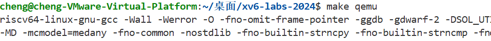

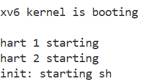

---

## sleep (easy)

### 1. 实验目的
通过模拟 UNIX `sleep` 命令实现简单的用户程序，掌握调度器对进程状态管理的基本原理，练习在 xv6 操作系统中使用已有系统调用（如 `sleep`、`exit` 等），并了解用户空间如何通过系统调用接口与内核交互，从而加深对用户态与内核态边界的认识。

### 2. 实验内容
1. 新建 `sleep.c` 并编写代码，其中 `argc` 表示命令行参数个数，`argv` 是字符串数组，存储各个参数的内容。若用户输入参数不为 2 个，则报错退出；否则将用户输入的字符串参数转换为整数，并调用 `sleep` 系统调用让进程暂停指定的 tick 数。

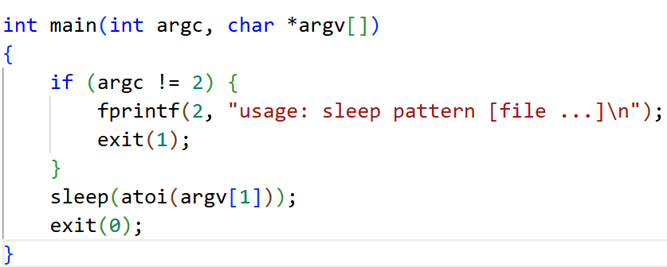

2. 在 `Makefile` 的 `UPROGS` 中添加 `sleep` 程序。


3. 输入 `make qemu`，并运行 `sleep` 程序（这里选择 `sleep 10`），初步判断程序能否暂停指定的 tick 数，然后输入 `Ctrl-a` 再输入 `x` 退出。


4. 输入 `./grade-lab-util sleep` 或 `make GRADEFLAGS=sleep grade`，验证程序能否通过与 `sleep` 相关的所有测试用例。


### 3. 问题解决
1. 不了解代码的编写方式，我通过查找资料和回顾其他代码进行学习，例如应使用 `exit(0)` 而不是习惯性地使用 `return 0` 来结束 `main` 函数，从而正常结束用户进程。
2. 确定需要包含的头文件，熟悉它们分别起到的作用，例如因为是用户添加的系统调用，所以需要包含 xv6 已提供的 `user/user.h`。

### 4. 实验心得
本次实验让我对 xv6 操作系统的工作机制有了初步的认识，学习了在 xv6 环境下编写、编译和测试用户程序的基本方法。整个系统调用包括从用户程序发起调用、进入内核态、执行具体内核函数，体现了操作系统中用户态与内核态的关联和切换。

---

## pingpong (easy)

### 1. 实验目的
本实验旨在通过使用管道和进程间通信技术，理解父子进程之间如何通过 `pipe()` 函数实现双向数据传输。此外，通过 `fork()` 创建子进程，以及合理使用 `close()` 关闭不需要的管道端口，提升对进程间通信及其管理的理解，为深入掌握操作系统中的进程控制和同步机制奠定基础。

### 2. 实验内容
1. 本实验是使用管道 `pipe` 和 `fork` 实现父子进程之间通信的经典例子，程序完成的功能是父进程向子进程发送一个字节，子进程读取该字节后再向父进程发回一个字节，类似 pingpong。
2. 定义两个整数数组，每个数组长度为 2，`[0]` 为读端，`[1]` 为写端，分别用于两个管道，其中 `parent_to_child` 为父进程写、子进程读，`child_to_parent` 为子进程写、父进程读；定义一个字符变量 `buffer`，初始为 `'p'`，作为传输字节的演示；创建两个无名管道用于父子进程间通信。用 `fork()` 创建子进程，返回值 `pid > 0` 表示父进程（返回的是子进程的 PID），`0` 表示子进程，`< 0` 表示创建失败，进而分别执行父子进程的情况。
3. 子进程情况下：先关闭无用端口防止误用或阻塞，然后子进程从父进程读 1 字节到 `buffer`，输出收到的数据并通过 `getpid()` 打印进程 ID，子进程将刚收到的字节发送给父进程并关闭刚刚用过的管道端口。

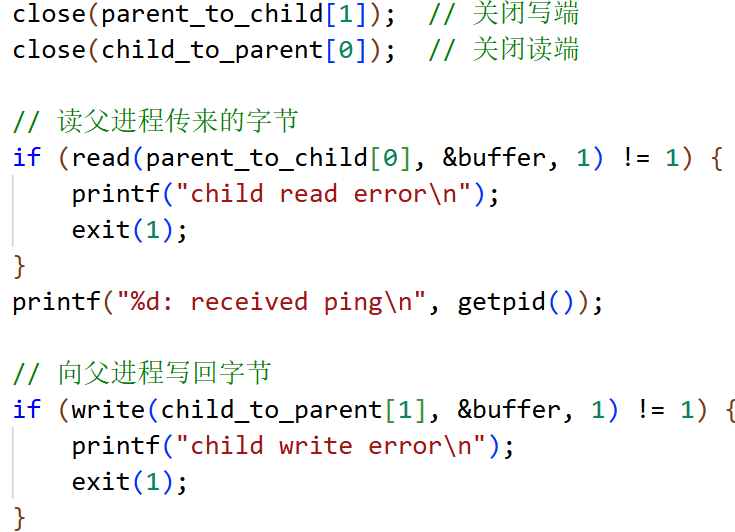

4. 输入 `make qemu`，并运行 `pingpong` 程序。

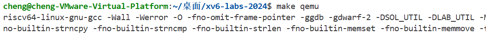

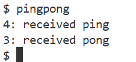

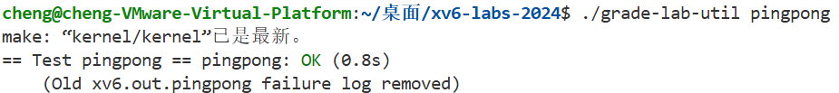


### 3. 问题解决
1. 对管道数据传输不熟悉，在自主学习 `pipe()`、`fork()`、`getpid()` 等方法后得到解决。
2. 没有调用 `close()` 关闭管道端口，导致进程间通信失败，在正确关闭管道端口并正确处理管道的读写顺序后得到解决。

### 4. 实验心得
通过本次实验，我深入理解了父子进程之间的通信机制，特别是管道的使用。同时，掌握了管道的读写操作及进程同步的基本原理，提升了对操作系统进程控制与通信的理解。遇到的问题如管道端口关闭和进程创建失败等，也让我更加熟悉了错误处理和资源管理的重要性。

---

## primes (moderate)/(hard)

### 1. 实验目的
本实验旨在通过实现递归筛选素数算法，深入理解进程间通信和进程创建的机制。使用 `fork()` 创建子进程，利用管道 `pipe()` 进行父子进程间的数据传递，实现“埃拉托斯特尼筛法”的递归筛选过程。通过此实验，掌握管道的读写操作、进程间同步与资源管理，提升对操作系统中进程控制、通信和递归算法的理解。

### 2. 实验内容
1. 本实验实现经典的埃拉托斯特尼筛法寻找素数，采用递归与管道机制实现父子进程间的通信和筛选操作。
2. 先定义递归函数，递归处理从文件描述符 `fd` 中读取数据并筛选；当 `read()` 为 0 时表示数据已读完，关闭管道并输出。
3. 创建管道 `p`，通过 `fork()` 创建子进程。
4. 子进程情况下：子进程关闭管道写端 `p[1]`，关闭原管道 `pd`，子进程递归调用 `func_ptr(p[0])`，传递新的管道读取端口 `p[0]`，进一步筛选素数。

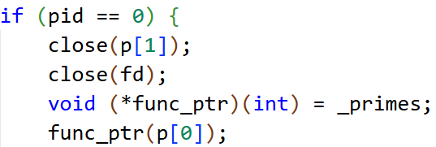

5. 父进程情况下：父进程关闭管道读端 `p[0]`，通过管道从 `fd` 读取数字，循环读取数字 `num`，如果 `num` 不能被当前素数 `prime` 整除，则将 `num` 写入新管道并传给子进程，最后关闭 `fd` 和 `p[1]` 释放资源。

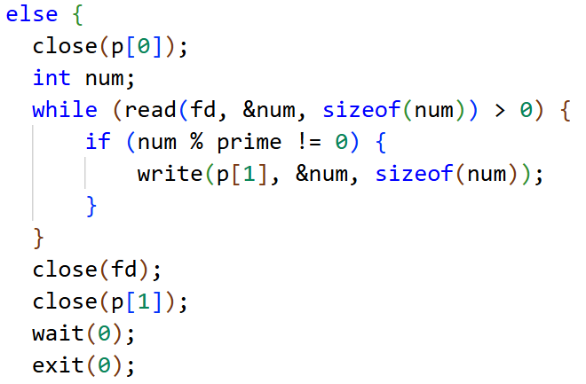

6. 输入 `make qemu`，并运行 `primes` 程序。

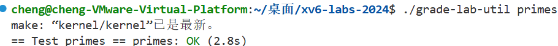


### 3. 问题解决
1. 在处理子进程部分时，由于没有理清管道查找素数的逻辑，没有关闭原管道 `fd`。
2. 相比于非递归方法的循环和队列，递归方法代码简洁，更适合展示递归思想和理解进程间通信的原理，但由于频繁的进程创建和通信开销，不适合处理大规模数据，但符合本实验的要求。

### 4. 实验心得
通过本次实验，我深入理解了进程间通信和递归算法的结合应用。通过管道实现父子进程间的数据传递，采用递归方式实现埃拉托斯特尼筛法，增强了我对进程管理和进程间同步的理解。实验中遇到的进程创建和管道操作的细节，让我体会到了操作系统资源管理的重要性。

---

## find (moderate)

### 1. 实验目的
本实验旨在通过实现简化版的 `find` 命令，深入理解文件系统的基本操作，包括目录遍历、文件属性获取与字符串处理等。通过系统调用如 `open`、`read`、`stat` 等，掌握在 xv6 操作系统中如何进行递归搜索特定文件，提高对目录结构、文件描述符与系统资源管理的理解，增强分析和编程能力。

### 2. 实验内容
1. 本实验仿照 Unix 系统中的 `find` 命令实现简单的查找文件程序，在指定目录及其子目录下查找名为 `target` 的文件，通过递归搜索并打印所找文件的完整路径。
2. 定义 `find` 函数，参数 `path` 为要找的目录路径，`target` 为要找的文件名；分别定义打开的目录文件描述符、目录项结构体和文件或目录的状态信息。
3. 使用 `open()` 打开目录 `path`，返回 `fd`，`0` 表示只读模式；使用 `fstat()` 获取目录文件的状态信息并储存结果；将路径拷贝到缓存区并在每段路径结束后加入路径分隔符 `\`。
4. 使用 `read()` 遍历目录文件内容并判断文件类型，其中跳过代表当前目录和父目录的 "." 和 ".." 这两个特殊目录项，生成新路径。

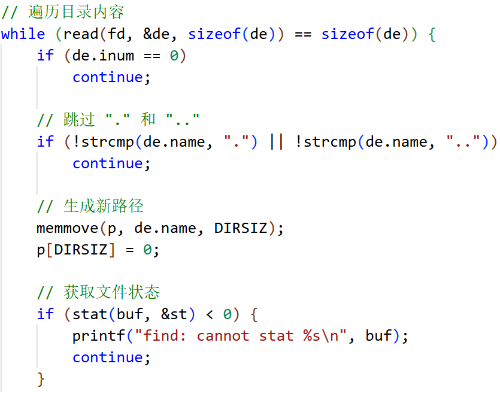

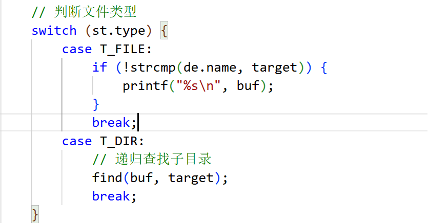

5. 输入 `make qemu`，并运行 `find` 程序。

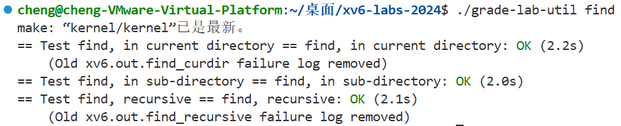

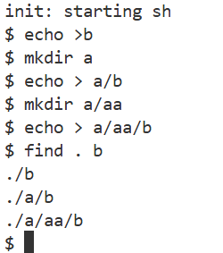


### 3. 问题解决
1. 最开始没有考虑到跳过 "." 和 ".." 这两个特殊目录项，导致打印出的路径出现问题。
2. 路径长度可能超出限制，导致路径拼接时出现问题，后来引入了缓存区数组限制。

### 4. 实验心得
通过本次实现 `find` 命令的实验，我深入理解了 xv6 文件系统的目录结构与文件遍历方法，掌握了 `open`、`read`、`stat` 等系统调用的实际用法。在动手调试过程中，我也体会到递归调用在处理树形结构上的便利与风险，增强了对底层操作系统资源管理的认识。

---

## xargs (moderate)

### 1. 实验目的
本实验旨在通过实现类似 `xargs` 的功能，深入理解进程间的基本操作，如 `fork()`、`exec()` 和 `wait()`。通过将标准输入中的每行数据作为命令行参数传递给子进程执行，掌握如何构建命令行参数、启动子进程执行任务并同步父子进程。实验加深了对进程管理、内存分配、进程间通信和命令行解析的理解，提升了对操作系统底层原理的掌握。

### 2. 实验内容
1. 本实验要将标准输入每行的内容作为参数添加到原命令后，每读取一行就 `fork + exec` 执行一次命令，使用空格分割输入行，允许多个参数，支持基础命令带原始参数。
2. 逐字符读取输入，读到换行符则终止字符串；新建 `full_argv` 保存完整命令参数（包括 base 和输入部分），新建 `arg_index` 作为追加参数的指针，使用指针 `p` 遍历字符串并处理空格部分。

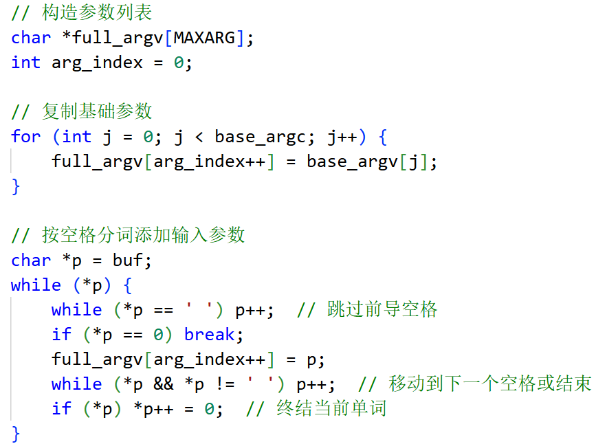

3. `fork()` 创建子进程，`PID` 为 0 时启动 `full_argv[0]` 代表的程序，`PID > 0` 时调用 `wait()` 系统调用，它会阻塞并等待子进程完成。

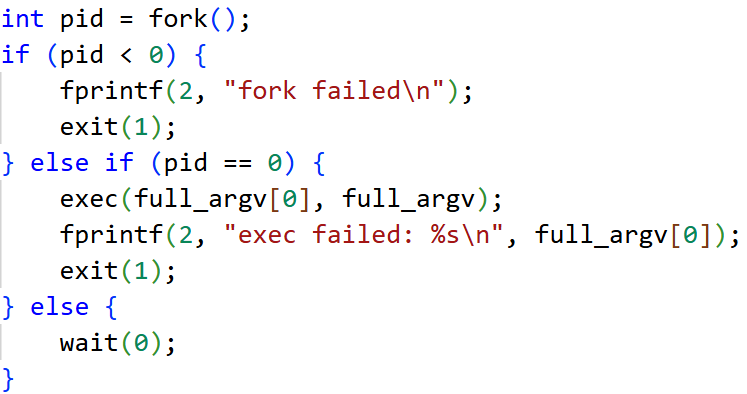

4. 输入 `make qemu`，并运行 `xargs` 程序。

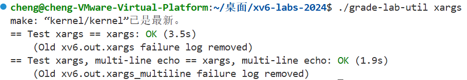

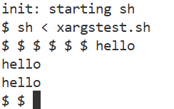


### 3. 问题解决
1. 缺少头文件 `#include "kernel/param.h"`，常量 `MAXARG` 没有定义导致报错。
2. 没有考虑到所有 `exec` 族函数都要求参数数组以 NULL 结尾，补充 `full_argv[arg_index] = 0;` 解决问题。

### 4. 实验心得
通过本次实验，我深入理解了 `fork()`、`exec()` 和 `wait()` 等系统调用的使用以及父子进程之间的协作方式。实现 `xargs` 功能让我学会了如何构建命令行参数并将其传递给子进程执行，同时掌握了如何通过 `wait()` 来同步父子进程，避免僵尸进程的产生。实验过程加深了我对进程管理和进程间通信机制的理解，提高了我在操作系统底层编程的能力。

---

## 实验得分

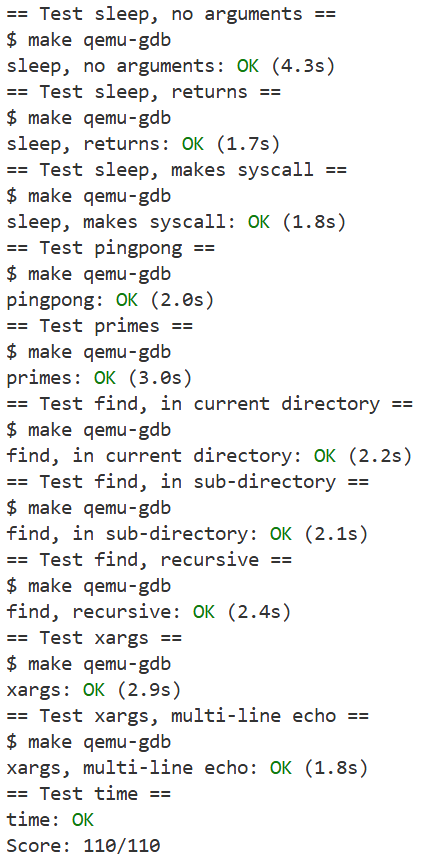