# Lab2 system calls

**2351759 程琮越**

- [Using gdb (easy)](#using-gdb-easy)
  - [1. 实验目的](#1-实验目的)
  - [2. 实验内容](#2-实验内容)
  - [3. 问题解决](#3-问题解决)
  - [4. 实验心得](#4-实验心得)
- [System call tracing (moderate)](#system-call-tracing-moderate)
  - [1. 实验目的](#1-实验目的)
  - [2. 实验内容](#2-实验内容)
  - [3. 问题解决](#3-问题解决)
  - [4. 实验心得](#4-实验心得)
- [Attack xv6 (moderate)](#attack-xv6-moderate)
  - [1. 实验目的](#1-实验目的)
  - [2. 实验内容](#2-实验内容)
  - [3. 问题解决](#3-问题解决)
  - [4. 实验心得](#4-实验心得)
- [实验得分](#实验得分)

---

切换到syscall分支

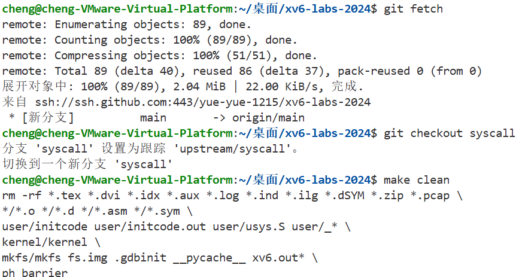


## Using gdb (easy)

### 1. 实验目的
本实验围绕xv6内核系统调用调试展开，从远程连接GDB开始，通过设置断点、单步执行等操作分析syscall函数。重点修改代码使程序访问无效地址0，观察内核崩溃现象，定位故障汇编指令、对应寄存器（如a3对应num），结合scause（0xd，加载页故障）和stval（0x0，故障地址），验证地址0未映射到内核空间，以此理解内核地址映射、异常处理及系统调用机制，完整掌握内核调试流程与底层原理。

### 2. 实验内容
1. 输入`make qemu-gdb`。

    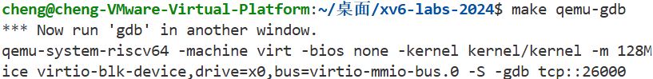

2. 打开另一个终端，先安装多架构GDB：
    ```bash
    sudo apt update
    sudo apt install gdb-multiarch
    ```
    再调试xv6：
    ```bash
    gdb-multiarch kernel/kernel
    ```
    然后在GDB中连接QEMU。

    

3. 设置断点并继续执行直到触发断点。

    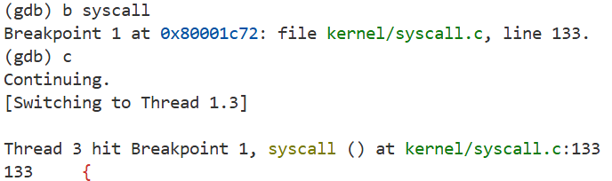

4. 输入`layout src`将窗口一分为二，可查看源码布局。

    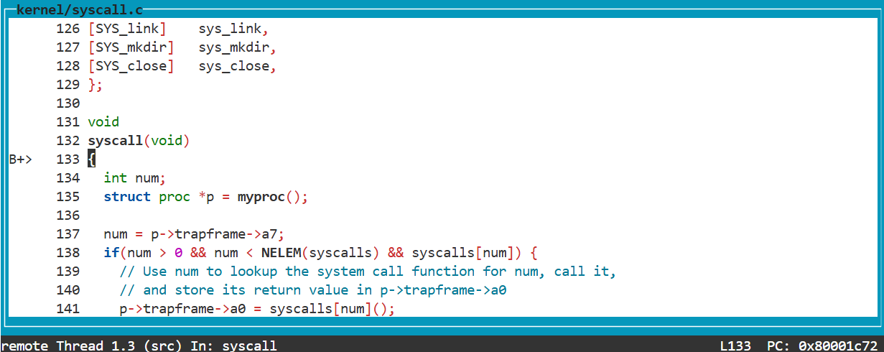

5. 输入`n`直到跳过`struct proc *p = myproc();`，打印当前进程的结构体。

    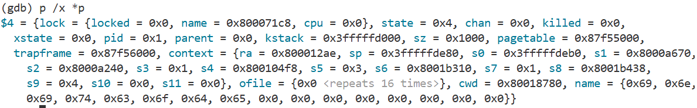

6. 查看`p->trapframe->a7`的值，查看`sstatus`寄存器，查看调用栈：
    - `p->trapframe->a7`的值为`0x7`，表示系统调用号，用于告诉内核用户程序请求执行哪个系统调用。
    - 要看CPU之前处于什么模式，可以查看`sstatus`寄存器中SPP位（第8位），SPP位为0表示CPU之前处于用户模式。

      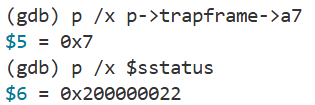

    - 用`backtrace`可以看到`usertrap()`就是直接调用`syscall`的函数。

      

7. 将`syscall.c`中`num = p->trapframe->a7;`替换为`num = *(int *)0;`会导致内核panic，要追踪内核page-fault panic的来源，需要搜索刚刚看到的panic打印的`sepc`值在文件`kernel/kernel.asm`，其中包含编译的内核。

    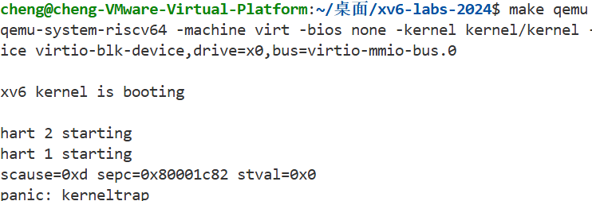

8. 崩溃时执行的汇编指令：`lw a3,0(zero)`，对应`num`变量的寄存器：`a3`。

    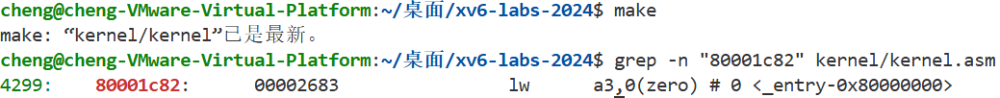

    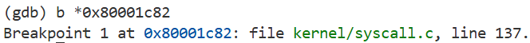

9. 输入`layout asm`，再输入`c`，程序会停在`lw a3,0(zero)`指令处，这是崩溃前的最后一条指令。

    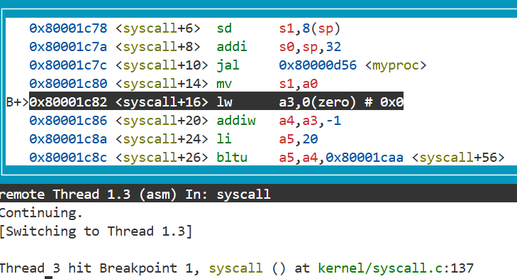

10. 确认内核panic时正在运行的进程的名称及进程ID。

    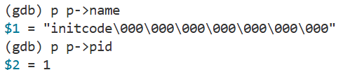

### 3. 问题解决
1. 最开始想尝试`gdb kernel/kernel`（启动GDB并加载内核符号）发现单步执行时出现`(gdb) c The program is not being run.`的问题，安装多架构GDB解决问题。
2. 修改`syscall.c`后未重新编译内核，`kernel.asm`仍是旧版本，不包含新的`sepc`地址导致`grep -n "80001c82" kernel/kernel.asm`在终端执行依然查找不到，输入`make`重新编译可以解决问题。

### 4. 实验心得
本次实验让我深入理解了xv6内核调试流程。从解决GDB连接问题到分析崩溃原因，每步都需细致操作。通过观察寄存器状态和汇编指令，我直观认识到无效地址访问的后果，也明白了`scause`、`stval`等寄存器在异常处理中的作用，深刻体会到理论与实践结合对掌握操作系统内核原理的重要性。

## System call tracing (moderate)

### 1. 实验目的
本实验旨在为xv6操作系统添加系统调用跟踪功能。通过创建`trace`系统调用，使进程能设置跟踪掩码，指定需跟踪的系统调用。修改内核让符合掩码的系统调用在返回时输出进程ID、调用名及返回值，并确保掩码可由子进程继承，最终实现对特定进程及其子进程的系统调用跟踪，辅助后续调试。

### 2. 实验内容
1. 添加系统调用编号和用户空间接口：
    - 修改`kernel/syscall.h`，添加系统调用编号：
        ```c
        #define SYS_trace  22
        ```
    - 修改`user/user.h`，添加函数原型：
        ```c
        int trace(int);
        ```
    - 修改`user/usys.pl`，添加系统调用存根：
        ```perl
        entry("trace");
        ```
2. 修改进程结构以存储跟踪掩码，修改`kernel/proc.h`中的`proc`结构体。
```c
struct proc {
  struct spinlock lock;
  int trace_mask; // add
}
```
3. 实现`trace`系统调用，在`kernel/sysproc.c`中添加`sys_trace`函数。
```c
// 新增系统调用：设置当前进程的跟踪掩码
uint64 sys_trace(void) {
  int mask;
  // 从用户空间获取掩码参数
  if(argint(0, &mask) < 0)
    return -1;

  // 设置当前进程的跟踪掩码
  myproc()->trace_mask = mask;
  return 0;
}
```
4. 修改`fork`以继承跟踪掩码，在`kernel/proc.c`的`fork`函数中，确保子进程继承父进程的跟踪掩码。
```c
int
fork(void)
{
  int i, pid;
  struct proc *np;
  struct proc *p = myproc();

  // Allocate process.
  if((np = allocproc()) == 0){
    return -1;
  }
  np->trace_mask = p->trace_mask;  // add
```
以下是格式调整后的完整内容，可直接复制使用：

```markdown
5. 修改系统调用处理函数以打印跟踪信息，修改`kernel/syscall.c`：
    - 首先添加系统调用名称数组并声明函数。
```c
  extern uint64 sys_close(void);
  extern uint64 sys_trace(void);
```
```c
static char *syscall_names[] = {
  [SYS_fork]   "fork",
  [SYS_exit]   "exit",
  [SYS_wait]   "wait",
  [SYS_pipe]   "pipe",
  [SYS_read]   "read",
  [SYS_kill]   "kill",
  [SYS_exec]   "exec",
  [SYS_fstat]  "fstat",
  [SYS_chdir]  "chdir",
  [SYS_dup]    "dup",
  [SYS_getpid] "getpid",
  [SYS_sbrk]   "sbrk",
  [SYS_sleep]  "sleep",
  [SYS_uptime] "uptime",
  [SYS_open]   "open",
  [SYS_write]  "write",
  [SYS_mkdir]  "mkdir",
  [SYS_unlink] "unlink",
  [SYS_link]   "link",
  [SYS_mkdir]  "mkdir",
  [SYS_close]  "close",
  [SYS_trace]  "trace"
};
```
    - 再修改`syscall`函数。
```c
void syscall(void) {
  int num;
  struct proc *p = myproc();

  num = p->trapframe->a7;
  if(num > 0 && num < NELEM(syscalls) && syscalls[num]) {
    // 调用系统调用函数并获取返回值
    p->trapframe->a0 = syscalls[num]();

    // 检查是否需要跟踪此系统调用
    if(p->trace_mask & (1 << num)) {
      // 打印进程ID、系统调用名称和返回值
      printf("%d: syscall %s -> %d\n", p->pid, syscall_names[num], p->trapframe->a0);
    }
  } else {
    printf("%d %s: unknown sys call %d\n",
           p->pid, p->name, num);
    p->trapframe->a0 = -1;
  }
}
```
    - 然后在`syscalls`数组中添加`sys_trace`条目。
```c
[SYS_close]    sys_close,
[SYS_trace]    sys_trace    // add
```
```
6. 在`Makefile`的`UPROGS`部分添加`$U/_trace \`。
7. 进行验证。

    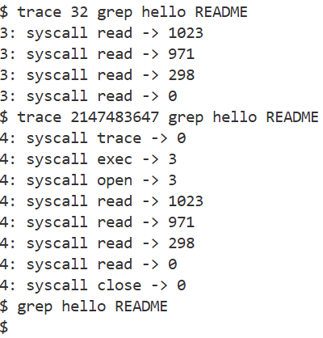

    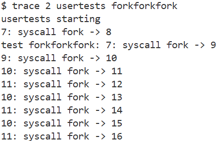

    

### 3. 问题解决
1. 在`kernel/syscall.c`顶部位添加添加函数声明，导致未定义的错误。
2. 格式字符串与参数类型不匹配的问题，`%d`去格式化一个`uint64`类型的变量导致输出结果不正确，修改前为`printf("%d: syscall %s -> %d\n", p->pid, syscall_names[num], p->trapframe->a0);`，修改后为`printf("%d: syscall %s -> %ld\n", p->pid, syscall_names[num], p->trapframe->a0)`。

### 4. 实验心得
完成xv6系统调用跟踪实验，让我深入理解了系统调用的实现流程。从添加系统调用编号、用户接口，到修改进程结构存储掩码、实现跟踪逻辑，每步都需兼顾内核与用户态交互。`fork`时继承掩码的设计，让我体会到进程间状态传递的细节，也明白了调试工具背后的内核机制，提升了对操作系统运行的理解。

## Attack xv6 (moderate)

### 1. 实验目的
本实验旨在通过修改`user/attack.c`，利用xv6内核的内存分配漏洞（新分配内存保留前使用者数据），提取`secret`进程退出后遗留的8字节秘密并输出到文件描述符2。以此理解内核漏洞如何破坏进程隔离，体会系统安全中内存清零的重要性，掌握漏洞利用的基本思路。

### 2. 实验内容
1. 漏洞环境已经预先搭建完成，`#ifndef LAB_SYSCALL`使清零代码被自动排除，从而实现“内存分配后保留之前的内容”的漏洞效果。
2. 先使用`sbrk(PGSIZE*17)`分配了17页内存（实际使用的内存应该是与第一段代码中分配的内存区域重叠）；然后通过`end + 32`来定位到第一段代码写入`argv[1]`（即传入的秘密密码）的内存地址；最后将8字节秘密写入文件描述符2（stderr）。

    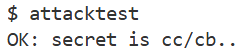

3. 要使攻击有效，必须确保密码数据在`end + 32`这个位置，因此不能将32改为0。如果修改为0，攻击就会失效，因为代码的内存布局和攻击的预期位置都发生了变化。

### 3. 问题解决
1. 出现`FAIL: no/incorrect secret`错误，若未准确找到`secret`进程存储秘密的位置，会导致读取到无效数据。需确认`secret`进程的内存布局，确保偏移量正确。
2. 如果传入的`argv`（即密码）过长，可能会导致溢出，并覆盖临近的内存区域，这会破坏其他数据。如果常量字符串的结束位置紧挨着密码存储的位置（`end + 32`），那么密码的存储可能会覆盖常量字符串，导致数据丢失或错误。

### 4. 实验心得
本次实验让我深刻体会到内核细节对系统安全的重要性。内存未清零的微小漏洞能让进程突破隔离获取敏感信息，说明了内核开发需注重细节，任何看似无关的操作（如内存清零）都可能成为安全隐患。同时，我也理解了漏洞利用的基本逻辑，为今后学习系统安全打下基础。

## 实验得分

  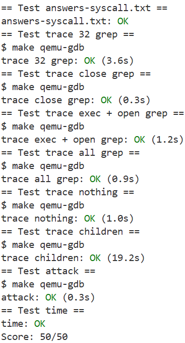